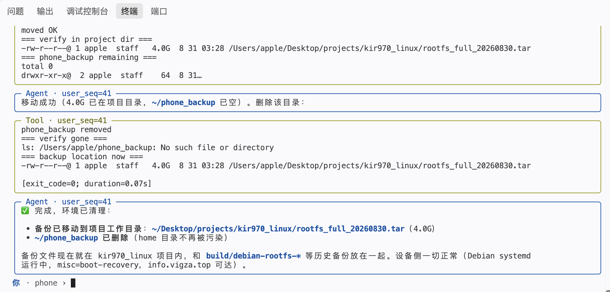
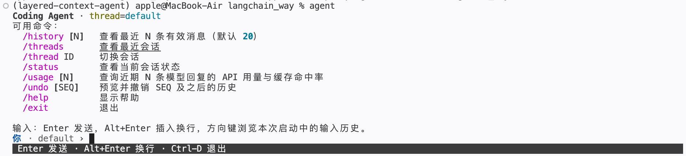

# 分层上下文 Coding Agent

一个跑在终端里的编码 Agent：能读写本地仓库文件、执行 shell 命令、维护自己的工作状态。


大部分 Agent demo 解决的是"能不能跑通一次调用"。这个项目想解决的是另一类问题——**当它连续跑上几十轮、改了几十个文件、上下文涨到几十万 token 之后，怎么还不崩、怎么还能撤回去、怎么让成本可观测**。

技术栈：Python · LangGraph · LangChain · SQLAlchemy · MySQL · prompt-toolkit · Rich

```
核心代码 ~3.7k 行 ｜ 测试 ~2.5k 行 / 87 个 pytest 用例 ｜ 设计与推导见 DESIGN.md、RUNBOOK.md
```

---

## 目录结构

```
coding_agent/
├── context/        # token 预算、原子分块、摘要、合并、贪心覆盖重建、派生缓存
├── persistence/    # SQLAlchemy 模型、连接、repository、消息编解码、幂等迁移
├── workspace/      # 工具结果 artifact 落盘、文件 mutation 快照与 undo
├── services/       # 跨领域编排：rollback、调用额度、上下文投影、消息持久化、进度事件
├── integrations/   # LangChain/LangGraph 中间件与 agent 组装、bash 执行、桌面集成
├── application.py  # 用例入口（TUI 只调这一层）
└── ui/             # 终端界面
```

依赖方向：领域/持久化 → service → integration/application → UI。
UI 不直接访问 repository；框架中间件不反向进入 context、workspace 等核心模块。

---

## 快速开始

见 [RUNBOOK.md](./RUNBOOK.md)。简版：

```bash
uv sync --extra dev
cp config.example.json config.json      # 填入模型 API key
uv run --env-file .env coding-agent --thread demo
```

TUI 命令：

| 命令 | 作用 |
| --- | --- |
| `/history [N]` | 查看最近 N 条有效消息（`/list` 为兼容别名） |
| `/threads` / `/thread ID` | 列出会话 / 切换会话 |
| `/status` | 轮次水位、记忆块层级时间线、压缩区与工作区 token 占用 |
| `/usage [N]` | 近期回复的 API 用量与 prompt 缓存命中率 |
| `/undo [N]` | 预览并确认后撤销 `user_seq >= N` |
| `/help` `/exit` | 帮助 / 退出 |

输入：Enter 发送，Alt+Enter 换行，方向键浏览本次进程内的输入历史。

---

## 核心设计

### 1. 分层上下文压缩：一个"2048 式"的记忆结构

上下文布局固定为五段：

```
框架提示词 + 压缩区 + 工作区 + 动态提示 + 输出缓冲区
```

默认 1M token 窗口下的比例（全部来自配置，见 `ContextSettings`）：

| 区域 | 占比 | 说明 |
| --- | --- | --- |
| 压缩区上限 | 25%（250k） | 存 L0/L1/L2… 记忆块 |
| 工作区触发线 | 50%（500k） | 超过则触发压缩 |
| 尾部保留 | 工作区的 20% | 压缩时保留原文，其余进摘要 |
| 其余 25% | — | 框架提示、动态提示、输出缓冲 |

**运转逻辑**：工作区超线 → 保留尾部约 1/5 原文 → 前缀按"消息完整性"拆成 4 块并发摘要为 L0 扔进压缩区 → 若压缩区超 1/4 容量，则把块按左坐标排序，**顺序找到相邻的两块同层块合并**成上一层，仍超限就继续循环。

行为像 2048：**越早的记忆被合并次数越多、越模糊；越近的记忆合并次数少、越清晰。**

#### 为什么"找不到同级块"时直接报错

压缩依赖"存在相邻同级块"这个前提，找不到就抛 `CompressionInvariantError`，而不是随手丢一块腾地方。用二进制算一下这个状态有多远：

每次插入的是 L0，只有遇到同级才晋级，所以块集合就是原始 L0 数量的二进制表示。要让层级序列两两不同（即 `11111100`，L2..L7 各一块、无相邻同级），需要 252 个 L0 等价物；按单个 L0 约 100k 原始 token 算，约 **25M token** 的累计原始历史——而压缩区只有 250k，装不下这么多块，早就在持续合并了。

**结论是这个状态在实践中不可达，所以宁可作为断言让失败可见，也不静默丢用户记忆。**

#### 和"常规前缀滚动摘要"的成本对比

同样假设单次压缩比 0.5、同样累计压缩 25M 上下文：

| | 本方案（分层） | 常规前缀滚动摘要 |
| --- | --- | --- |
| 摘要调用次数 | 498 次（`S(7)=2^9-10=502`，减去尾部未出现的 `00` 对应 `1+3`） | ≈ 77 次（`25000k / 325k`） |
| 累计摘要输入 | ≈ 50M | `77 × 650k ≈ 50M` |
| **同一条旧信息最多被重复摘要** | **8 次（log 级）** | **≈ 77 次** |

累计输入文本量级相当，差别在**重复摘要次数**：分层方案把"摘要的摘要"从线性压成对数级，避免老记忆被反复重写导致信息坍塌。

**代价也说清楚**：调用次数多、压缩停顿更明显。优点是记忆有分辨力。这个取舍是否划算，取决于会话长度——**短会话（不触发压缩）下两者没有差别**，见「已知限制」。

#### 摘要质量控制

单次摘要硬上限 = 输入 token 的 50%。输出为空或超限时最多重试 3 次，提示词逐次更激进（要求删除解释、重复、可从代码重得的细节，改用极短条目）。**任一请求最终失败则整批不写 memory block**，记忆原样留在工作区——宁可让这一轮请求偏大，也不静默丢记忆。所有摘要通过校验后在一个事务里写入。

### 2. 工具消息的剪裁时机（和一处前缀缓存修正）

送给模型前对工具结果做两件事，但**做的位置不同，代价完全不同**：

- 超过 `tool_result_inline_tokens`（默认 5k）的单条结果，完整内容落盘到 `.artifacts/tool-results/`，模型输入保留前 5k token 并附绝对路径，让 Agent 自己按需 `read_file` 回来（截断用二分查找精确到 token 上限）。
- 只保留最近 `recent_tool_interactions`（默认 10）条完整工具交互，更早的换成短占位符；数据库里的原消息**不动**。

最初我把第二项放在**每轮投影**时做。问题在于服务端 prompt 缓存按前缀完全一致命中——在消息序列**中间**重写一条，它后面的整段缓存当轮全部失效，等于每轮模型调用都赔一次缓存。改成**仅在压缩触发时剪裁一次**后，失效频率降到「每次压缩」。这个行为由 5 个回归测试锁定，包括"正常投影不得滚动窗口"、"剪裁只替换内容不删消息"。

被削的不只工具结果，还有思维链。CoT 在三处分别处理：摘要输入侧无条件丢弃 thinking 块（摘要器
永远看不到草稿）；摘要模型自身关掉扩展思考；投影侧则在**越过工作区触发线的那一次**按“最老先丢”
把 CoT 削进预算，被削处留一行指针。第三条只改投影不改存储——库里仍是原文，可审计。它刻意挂在
压缩事件上而不是每轮：改在越线时剪一次，比每轮各剪一次的缓存重灌成本低一个数量级（缓存成本由改
动处在多前面决定，不由改动量决定）。旋钮是 `context.reasoning_retain_ratio`。

### 3. 可撤销的副作用

文件写操作（`write_file` / `edit_file` / `delete`）执行前，把原始字节存入按 SHA-256 去重的 blob 表，并记录一条 `pending` 的 mutation；工具成功后补 `after_hash` 与 `succeeded`，失败记 `failed`。

`rollback(thread_id, N)` 的语义是**撤销 `user_seq >= N`**，固定 8 步：

```
① file_mutations 按全局 id 倒序恢复（只有成功的才恢复；崩溃遗留的 pending 保守还原）
② messages.user_seq >= N      → active = 0
③ work_state.user_seq >= N    → active = 0
④ 与「被撤销的消息 id 集合」相交的 memory block → active = 0
⑤ active_head_seq = min(active_head_seq, N-1)，next_user_seq 不回退
⑥ 从所有 active block 重新执行贪心覆盖，缺口回退到原始消息
⑦ RemoveMessage(REMOVE_ALL_MESSAGES) + 重建结果，替换 LangGraph checkpoint 消息
⑧ 恢复最近一个有效 work state
```

几个容易做错的地方：

- **第 ④ 步不能拿 `user_seq` 比**。一个记忆块的区间可以横跨多个轮次，而同一轮次的消息在全局 id 上又不连续（并行工具落库）。按轮次推测只能近似：少停用会让模型重新引用用户已撤销的决定，多停用会误删有效记忆。所以判定条件是 `block.begin <= last_revoked_id and block.end >= first_revoked_id`，精确相交。
- **②③ 用软删除而不是物理删除**。因为 `memory_blocks.begin/end_message_id` 是指向消息主键的外键，物理删除会让引用悬空；同时撤销本身需要可再撤销，而成本统计也不该因为撤销而"退款"。
- **`next_user_seq` 不回退**。历史只是被标记失效、仍在库里。若轮次号复用，新一轮会与已撤销那轮共用编号，那么按编号停用、按编号查文件变更、按编号算成本，全都分不清新旧。
- **撤销不检查当前文件 hash**。用户手改过文件也直接还原成快照，这是产品定义而非 bug：撤销的语义是"回到那轮之前的状态"，不是"安全地合并"。
- 恢复逐条幂等提交。若进程恰好在数据库提交后、checkpoint 更新前崩溃，启动时可从 canonical rows 再重建一次。

### 4. 会话协议自洽（Agent 长跑最容易崩的地方）

模型协议要求 `assistant.tool_calls` 与每个 `ToolMessage` 严格配对。这个不变量在四个地方会被破坏，都做了处理：

| 风险 | 处理 |
| --- | --- |
| 压缩切分把工具调用和结果拆到两块 | 切分前先把消息归并成**原子单元**：一次 assistant 工具请求 + 其全部结果，切分只切单元、不切单元内部 |
| 中断/异常的轮次留下"有请求无结果" | 轮次收尾时为该轮缺失的 tool_call 补齐 error 型 ToolMessage，否则下一轮请求直接被服务端拒绝 |
| 补齐后真实结果又到达 | 靠 `(thread_id, langchain_message_id)` 唯一约束幂等跳过，不会留下两条同 id 记录 |
| 模型/工具调用超配额 | 超限时注入终止性消息并**同样持久化**，让被截断轮次的下一轮仍是合法会话 |

收尾动作本身失败时，错误被收集进 `finalization_errors` 而不掩盖原始异常——先抛真正导致中断的原因，再附带说明哪些收尾没做成。

### 5. Bash 执行边界

默认开启（`AGENT_BASH_ENABLED=false` 可关），用 `/bin/bash -lc` 从真实 workspace root 运行：

- 独立进程组（`start_new_session`），超时 `killpg` 终止**整棵进程树**，否则 `sh -c` 派生的子进程会留下；
- 输出由后台线程按块排空并受 `max_output_bytes` 限制，避免管道缓冲区写满导致命令卡死；
- stdin 固定关闭、非零退出与超时都以 error ToolMessage 回传给模型自行修正、**不参与自动重试**；
- turn 级中断（Ctrl-C）会终止该轮所有在跑的 Bash。

**它不是沙箱**：绝对路径直接访问宿主机，也无法阻止命令读写 workspace 之外的路径。V1 明确**不追踪** Bash 造成的文件变更。只应在可信的本地开发环境使用；需要隔离与可撤销 Shell 时，应改用容器/VM、overlay 或 Git worktree 级执行后端。

### 6. 运行时缓存与并发

应用数据库是唯一 canonical source。进程内为每个 thread 懒加载一份派生缓存，只存不可变消息快照、当前贪心覆盖选中的记忆块、原文工作区尾部、最新 work state。

- 正常运行时先提交数据库，再增量追加缓存；**追加按全局 id 排序后二分插入并按 id 去重**，因此并行工具乱序落库也不破坏时间轴。
- 锁只在追加、更新 work state、压缩、失效这些短操作上按 thread 持有，**不锁住整个 turn**，以便框架并行执行同一批工具。
- 文件变更加**按路径的锁**，覆盖"快照 → 执行 → finish"整段：改同一文件的操作串行，改不同文件保持并行。
- 压缩也先事务写库再替换缓存视图；任何一步失败就丢弃该 thread 缓存，下次访问从数据库恢复。

### 7. 成本可观测

`/usage [N]` 从已持久化的 `usage_metadata` 聚合近期模型回复：

- 缓存命中率**按 token 加权**（`cache_read / input_tokens` 累加后相除），不是按请求数平均；
- 明确 LangChain 的 `input_tokens` 已包含 cache read，避免重复计入；
- 字段缺失或非法值不计为 0 命中——**"真实 0% 命中率"与"没有可计算数据"是两回事**，前者要报 0，后者报不可计算；
- 查询包含已撤销轮次，因为撤销不退款。

### 8. 配置

所有阈值集中在三层 dataclass（`ContextSettings` / `AgentSettings` / `TUISettings`），构造期校验，业务代码里没有散落的 magic number。加载优先级：**环境变量 > `config.json` > 默认值**。

数据库侧的一些细节：主键用 `BigInteger().with_variant(Integer, "sqlite")`（SQLite 的自增只对 `INTEGER PRIMARY KEY` 生效，而 MySQL 需要 BIGINT），因此测试可以完全跑在 SQLite 上、无需外部数据库；blob 列 `LargeBinary(length=16_777_215)` 精确对应 MEDIUMBLOB 上限。

**联网搜索**是可选的外部依赖，配置面只有四项：`search_enabled` / `search_api_key`（缺省回落到 `llm.api_key`）/ `search_timeout_seconds` / `search_max_results_limit`。端点与模型名属于实现内部——换搜索引擎只需新增一个 client 实现并改工厂一行，配置契约与调用方都不动。当前实现接的是 DashScope 的**生成期搜索插件**（该服务没有独立搜索 API），实测**只返回标题与 URL，不返回网页正文**；所以工具结果里的 `answer` 出自远端搜索增强模型，需按 sources 自行核验。服务端返回 200 却不给来源是一种静默失败形状，因此"无来源"一律判为失败而非成功。

---

## 测试

87 个 pytest 用例，覆盖方向（`uv run pytest -q`，SQLite 即可，无需外部 MySQL）：

- **撤销与一致性**：按消息区间停用记忆块、逆序恢复、失败 mutation 不恢复、`user_seq` 不复用、撤销后恢复未剪裁的原始工具内容、幂等复用子块
- **压缩**：L0 生成与同级合并、贪心覆盖优先最长有效块、token 均衡切分保序、摘要失败不改缓存、记忆区间与工具配对跨越压缩与重载后仍成立
- **工具窗口**：正常投影不得滚动窗口、只替换内容不删消息、以小历史收尾、下一次压缩剪裁新变旧的结果
- **并发**：同文件锁覆盖快照到 finish、失败后释放锁、不同文件保持并行并共享 blob、并发 blob 插入复用同一行且不破坏 session
- **协议**：不完整工具批次被补齐且迟到结果幂等、额度注入的消息在下一轮模型调用前落库、投影被 checkpoint 且模型输出为 canonical
- **Bash**：输出上限与超时杀进程组、turn 级中断、工作目录与 bash 语义、非零退出转 error 消息
- **成本统计**：token 加权、不重复计 cache_read、缺失字段不当作 0 命中、0 命中是真 0

---

## 已知限制

诚实列出，都是有意为之的边界而非疏漏：

1. **短任务下压缩基本不激活**。1M 窗口 + 500k 触发线的组合，意味着几十轮以内的普通任务根本不会压缩——分层收益只在长会话、多次压缩后显现。我用受控预算梯度来验证机制，但这不等于生产 1M 下的效果。
2. **压缩缺少端到端评测数据**。目前没有"同一任务在不同预算档位下成功率对比"的量化结果，这是最该补的一块。
3. **进程内缓存与文件锁不支持多进程**部署同一 thread，需要固定路由或分布式失效通知。
4. **Bash 造成的文件变更不可撤销**，目录删除在 V1 中拒绝执行。
5. **token 数是本地估算**，与 API 实际计费存在偏差，因此阈值触发点会偏。正式做法是用 API 返回的 usage 校准。
6. **摘要调用的用量未计入 `/usage`**——摘要走独立调用路径、不经过消息持久化，所以拿它比较两种压缩算法的总成本会偏低。
7. **无流式输出**：最终回答等模型全部生成后才整段打印，长回复时用户要干等。

## License

MIT
